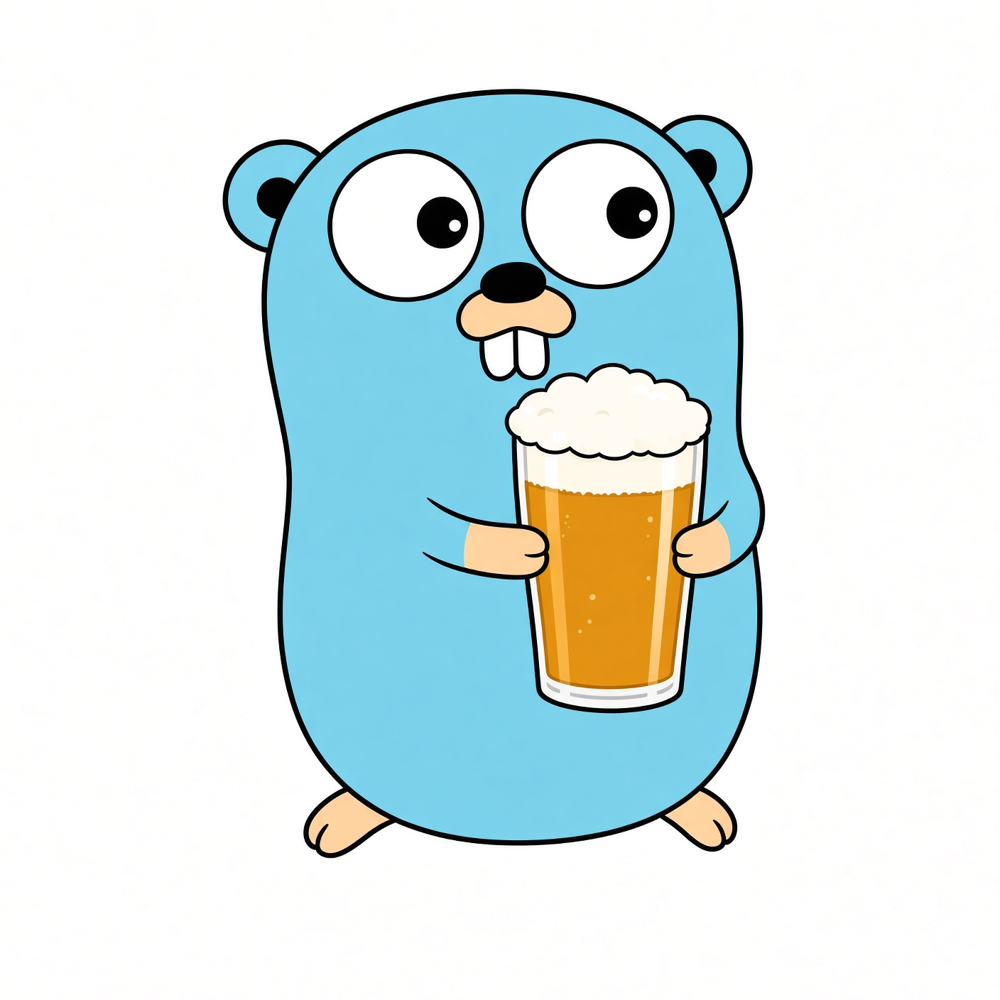

<p align="center">
  
</p>

# pint-go

Convert units in Go with [Pint](https://github.com/hgrecco/pint)'s English definition files and conversion rules. Magnitudes are `float64`. No CGO and no extra modules; the defs are embedded.

You parse a string and convert it. `Complete` suggests unit names if you need a picker.

How Pint works (definition lines, the conversion walk, contexts): [docs/how-it-works.md](docs/how-it-works.md). This package (concurrency, `Complete`, scope): [docs/go.md](docs/go.md).

## Install

```bash
go get github.com/dendrascience/pint-go
```

## Usage

```go
ureg, err := pint.NewRegistry() // default_en.txt + constants_en.txt
q, err := ureg.Parse("3.2 kPa")
q2, err := q.To("mbar")

ok, err := ureg.Compatible("degC", "degF")

c, err := ureg.Converter("degC", "degF")
f, err := c.Convert(20)     // 68
err = c.ConvertN(dst, src) // many samples, one converter

d, err := ureg.Converter("delta_degC", "delta_degF")

un, err := ureg.ParseUnitName("degC") // degree_Celsius
res := ureg.Complete("kilopa", 20)    // includes kilopascal
```

After `NewRegistry`, convert from many goroutines. Don't call `Define`, `Load`, or `EnableContext` while converting.

For a slice of values, build a `Converter` and call `ConvertN`. Parse the unit pair once. `ParseUnitName` canonicalizes what you store (`degC` becomes `degree_Celsius`). `Complete` returns full expressions for a typeahead (`kilopa` → `kilopascal`). JSON field names on those types are part of the API. `syncpint` leaves that code alone.

`Converter` is the service hot path (compile once, convert magnitudes). Context hops (PSU ↔ g/kg, nm ↔ THz, mol ↔ g) need a **scope** — an ordered list of context names and **quantity** params (`Param{Magnitude, Unit}`), the same contract as Python Pint (`mw=18*ureg("g/mol")`). Empty `Unit` is dimensionless (`n`). Zero extra args snapshots `r.active` (CLI). Services never call `EnableContext` on a shared registry. See [docs/conversion-profiles.md](docs/conversion-profiles.md). `@context` blocks load through `Load`, not `Define`. `Contexts()` lists canonical catalog rows (name + param keys) for a UI picker.

## Temperature

```text
20 degC → degF              = 68  (absolute)
5  delta_degC → delta_degF  = 9   (interval)
```

Pint adds `delta_*` companions for offset units (`degC`, `degF`). This package does too. The definition files also include dB, octave, contexts, and systems.

## Examples

```bash
go run ./examples/demo                 # walkthrough
go run ./examples/convert 20degC degF  # pint-convert analog
go run ./examples/bench                # ConvertN throughput
go run ./examples/complete 'kilopa'    # autocomplete JSON
```

More in [examples/README.md](examples/README.md).

## Keeping up with Pint

Pint's `default_en.txt` and `constants_en.txt` live in this tree. The source SHA is in `PINT_SHA` (now `6fc0533`, Pint ~0.26).

```bash
go run ./tools/syncpint --pint /path/to/pint
```

Run that to copy the two definition files, rebuild `testdata/inventory.yml`, and print tests that appeared or dropped. Bump the SHA, run `syncpint`, then fix the parser until the ported tests pass. Apps that import this module don't need a Pint git submodule.

`testdata/inventory.yml` marks each Pint `test_*` as `ported` or `skipped` with a reason. `go test ./tools/syncpint` fails if a sibling checkout (or `PINT_DIR`) has tests missing from that list. Skipped suites (NumPy, Dask, Matplotlib) show up by name. Three compound log-arithmetic cases match Pint's own xfails.

## License

BSD-3-Clause. Definition files keep the Pint copyright; see `LICENSE` and `LICENSE.pint`.
